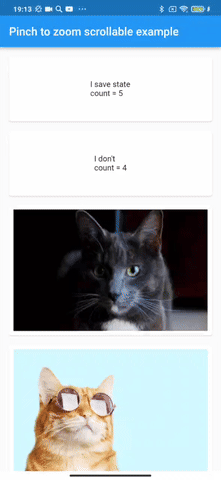

<div align="center" style="text-align:center">
<h1 align="center">PinchToZoomScrollable</h1>
</div>

A widget that makes another one pinch zoom, and return to its initial size and position when released.

PinchToZoomScrollableWidget is based on a fork of InteractiveViewer because the standard widget loses to ScrollView on GestureArena.

Also, the widget can preserve its state by transitioning to the Overlay and back.

| Example                        |
|--------------------------------|
|  |

## Usage

##### 1. add dependencies into you project pubspec.yaml file

```yaml
dependencies:
  pinch_to_zoom_scrollable: ^0.1.1
```

Run `flutter packages get` in the root directory of your app.

##### 2. import pinch_to_zoom_scrollable lib

```dart
import 'package:pinch_to_zoom_scrollable/pinch_to_zoom_scrollable.dart';
```

Now you can use `PinchToZoomScrollableWidget` as a widget in your code.

#### PinchToZoomScrollableWidget Props

| props | types | description |
| child |  `Widget`  | Child Widget. If [zoomChild] is null, child widget is used for zooming. |
| zoomChild |  `Widget?`  | Widget for zooming. |
| resetDuration | `Duration` | The duration of the reset animation. Default is Duration(milliseconds: 200). |
| resetCurve |  `Curve`   | The curve of the reset animation. Default is Curves.ease. |
| clipBehavior |   `Clip`   | Clipping behavior for InteractiveViewer. Default is Clip.none. |
| maxScale |  `double`  | The maximum allowed scale. Default to 8. |
| overlayColor |  `Color`   | Overlay background color. Default is Color(0x42000000). |
| saveState |   `bool`   | Use [GlobalKey] for saving state of [child]. Default is False. |
| rootOverlay |   `bool`   | Overlay.of(context) will use rootOverlay. Default is False. |

Feel free to fork this repository and send pull request 🏁👍
